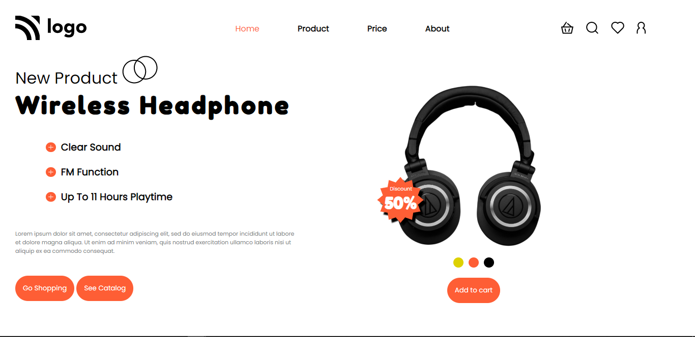
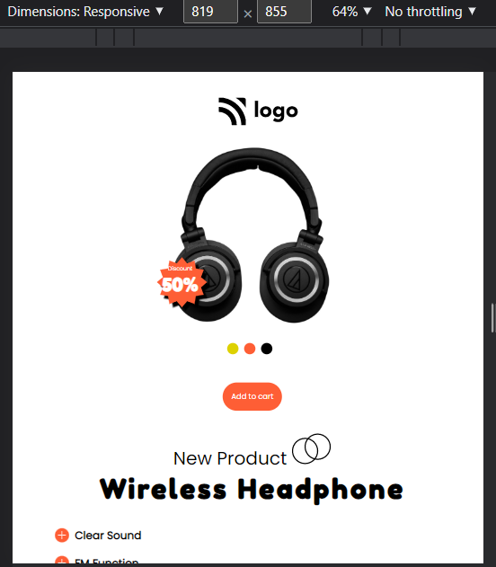
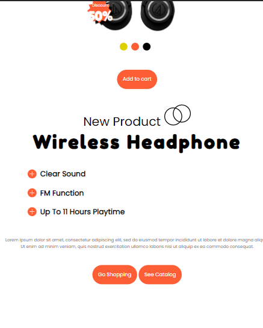
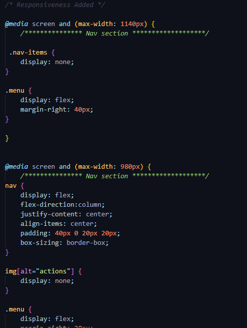

# Seventh Website in pure HTML and CSS

---

## Description
This is a landing page designed for an E-commerce firm in pure HTML and CSS. The overall design includes a lot of elements. Apart from the images and navbar placements, it has a bunch of `SVG` images that are floating on the web pages. The main problems with the floating images arise while making the design responsive. The overall time it took to complete this project was around `7-8 hours`. The majority of the time was consumed in finding the right CSS elements for the design but flexbox has made the task somehow easy. There are multiple elements in this project which require separate attention, such as icon SVG images in the navbar, headphone images, and discount SVG on top of it. The mid-section includes the description of the product and features. This project has taught me the value of `Flexbox`, `media queries`, and `box design` on a whole new level.

---

<!-- ABOUT THE PROJECT -->

## About The Project

Here's a Screen-Shot of my 7th project along with the code snippets.

 

 

 

<!-- PROJECT LOGO -->
 

  

<h3 align="center">Project 07</h3>
  
   
    <a href="https://harshal-project07.netlify.app/">View Live Demo</a>
  

## Built With

**Using Technologies**

1. `HTML`
2. `CSS`
3. `MarkDown`

> The challenge of this project was to make the design responsive from scratch with pure CSS without using any frameworks .

 

## Live Project

This project is presently deployed in **`Netlify Service`**.

[Live Project URL](https://harshal-project07.netlify.app/)
 

<!-- LEARNT -->
 

## Learnt
In This project I learnt the following properties of HTML and CSS.
- Flexbox and its Properties
- In depth of Responsive designs
- Media Queries
- Use of third party icons (svg)

 
<!-- CONTACT -->

## Contact

- **Name 👨‍💻:** [Harshal Verma](https://github.com/harshalvrm)
- **Email 📧:** [harshalvrm3@gmail.com](mailto:harshalvrm3@gmail.com)
- **Linkedln 📝:** [Click Here](https://www.linkedin.com/in/harshalvrm3/)
- **Blog 📝:** [Hashnode blog](https://xadai.hashnode.dev/)

 

[Project 7 Link](https://harshal-project07.netlify.app/) 

